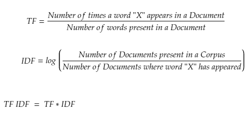

# TF-IDF Search Engine

 This project uses components written in **C**, **Rust**, and **Python** to create a search engine that uses the **TF-IDF algorithm** for ranking results. 

## The algorithm



The **TF-IDF (Term Frequency-Inverse Document Frequency)** algorithm is a statistical method used to evaluate the importance of a word in a document relative to a collection of documents (corpus). 

- **Term Frequency (TF):** Measures how often a word appears in a document. Words that occur frequently in a single document have a higher TF value.
- **Inverse Document Frequency (IDF):** Reduces the weight of words that are common across many documents, highlighting unique and meaningful terms.

## What’s Inside?

### The Core (C)
- Implements the **TF-IDF algorithm** to calculate and rank search results.
- Includes a **JSON reader/writer module** for handling input and output data.
- Uses **Quick Sort** to order data.

### The Interface (Rust)
- A modern **Graphical User Interface (GUI)** to make the search engine easy to interact with.
- Built with Rust for speed and reliability.

### The Scraper (Python)
- A web scraper to gather training data from Wikipedia.
- Handles data preprocessing, making it ready for the search engine.


## How It’s Organized

Here’s a quick look at the repository structure:

- `data/`: The data directory is responsible for storing the tokens necessary for the project.
- `engine/`: This folder contains the C code that runs everything.
  - `engine/include/`
  - `engine/src/`
- `gui/`: In the gui is the Rust code responsible for creating the interface.
  - `gui/src/`
- `scrapping/`: This is the web-scraping module with the Python script.

## Getting Started

### Prerequisites
Make sure you have these installed:
- A **C compiler** (GCC or Clang)
- **Rust** (latest stable version)
- **Python 3.9+**
- **Make**

### Setting It Up

1. Clone this repository:
   ```bash
   git clone https://github.com/AdrianoCLeao/search-engine.git
   cd search-engine
   ```

2. Navigate to the `scrapping` directory and set up the Python environment:
   ```bash
    cd scrapping
    python -m venv venv
    source venv/bin/activate  # On Windows, use venv\Scripts\activate
    pip install -r requirements.txt
   ```

3. Start the webscrapping to gather data:
   ```bash
   cd scrapping
   python main.py
   ```
When prompted, write the theme you want to scrape, and the engine will handle the rest.

4. After the completion of the scrapping, you can go back to the root directory and compile the C and Rust code:
   ```bash
   cd ../
   make
   ```

5. With the code compiled, you can run the project:
   ```bash
   make run
   ```

## Questions?

If you have any questions, feel free to open an issue or reach out to me at [my email](mailto:adrianocoelho@discente.ufg.br). 
